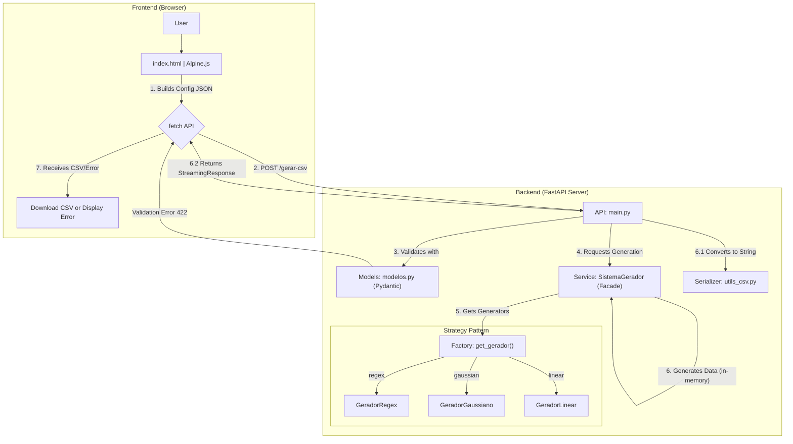

# Flexible Synthetic Data Generator

## 1. 📜 Introduction

The **Flexible Synthetic Data Generator** is a robust software tool designed to create synthetic datasets in CSV format with high configurability. The project addresses the needs of developers, testers, data analysts, and researchers by providing a fast and reliable way to generate data for software testing, performance analysis, or simulations.

The application is built as a modern web application, using:

  * **Backend:** **FastAPI** for a high-performance API.
  * **Frontend:** A reactive and user-friendly interface built with **Alpine.js** and **Bootstrap**, which communicates with the backend without the need for page reloads.

The main focus is to allow the user to define the structure of a CSV file and then populate each column using different generation "strategies", such as Regular Expression (Regex) patterns or statistical distributions.

## 2. 🚀 Key Features

The system implements a comprehensive set of functional and non-functional requirements, ensuring flexibility and reliability.

  * **Complete Structural Definition (RF01):** Allows the user to define the number of rows, column names, and the general structure of the CSV.
  * **Regex Data Generator (RF02):** Generates textual data that perfectly matches any provided Regular Expression (Regex) pattern.
  * **Gaussian Data Generator (RF03):** Generates numerical data that follows a normal statistical distribution (Gaussian), with configurable mean and standard deviation.
  * **Linear Data Generator (RF06):** Generates numerical data that follows a linear trend (e.g., a sequence with a fixed increment).
  * **Robust Input Validation (RF05):** The system validates all configurations before generation. This includes verifying the syntax of regular expressions and ensuring that statistical parameters (such as standard deviation) are valid (e.g., > 0).
  * **Format Configuration (RF09):** Allows the user to configure the field delimiter character (e.g., `,` or `;`) and the decimal separator (e.g., `.` or `,`).
  * **Reactive User Interface (RNF01):** An intuitive GUI that allows the user to dynamically add, configure, and remove columns without reloading the page.
  * **Extensible Architecture (RF08, RNF07):** The system design (based on the *Strategy* and *Factory* patterns) allows new types of generators (e.g., uniform distribution, exponential) to be added with minimal effort.

## 3. 🛠️ Tech Stack

| Category | Technology | Purpose |
| :--- | :--- | :--- |
| **Backend** | **FastAPI** | API Framework (ASGI). |
| | **Pydantic** | Data validation and configuration models. |
| | **Numpy** | Statistical data generation (Gaussian). |
| | **Rstr** | Regex-based data generation. |
| | **Uvicorn** | ASGI server to run FastAPI. |
| **Frontend** | **Alpine.js** | Reactivity and UI state management. |
| | **Bootstrap** | Layout and UI components. |
| | **Jinja2** | Initial HTML template rendering. |
| **Testing** | **Pytest** | Unit and integration testing framework. |
| | **HTTPX** | HTTP client for API testing (`TestClient`). |
| **DevOps** | **Poetry** | Dependency and package management. |
| | **Ruff** | Python code linter and formatter. |

## 4. 🏛️ Architecture Diagram (Mermaid)

This diagram illustrates the data flow and component architecture of the application, from user interaction to final file generation.



## 5. 📦 Installation

### Prerequisites

* Python 3.11+
* [Poetry](https://www.google.com/search?q=https://python-poetry.org/docs/%23installation) (Dependency Manager)

### Steps

1. Clone the repository:
```bash
git clone [https://github.com/CristhianKapelinski/syntheticdata--generator](https://github.com/CristhianKapelinski/syntheticdata--generator)
cd syntheticdata-generator

```


2. Install dependencies using Poetry:
```bash
poetry install

```


*(This will create a virtual environment and install all dependencies listed in `pyproject.toml` and `poetry.lock`)*

## 6. ▶️ Running the Application

To start the development server (with *hot-reload*), run the following command in the project root:

```bash
poetry run uvicorn src.gerador_dados.main:app --reload --host 0.0.0.0 --port 8000

```

The application will be available at: **[http://localhost:8000](https://www.google.com/search?q=http://localhost:8000)**

## 7. 👨‍💻 How to Use (Web Interface)

1. Access **[http://localhost:8000](https://www.google.com/search?q=http://localhost:8000)** in your browser.
2. **General Configuration:** Define the desired number of rows and, optionally, change the delimiter (e.g., `;`) and the decimal separator (e.g., `,`).
3. **Column Configuration:**
* The form starts with one column.
* Fill in the **Column Name**.
* Select the **Generator Type** (Regex, Gaussian, or Linear).
* Specific parameter fields will appear (e.g., "Regular Expression" or "Mean" and "Standard Deviation").


4. Click **"+ Add Column"** to add as many columns as needed.
5. Click **"Generate and Download CSV"**.
6. The system will validate your input.
* **If there is an error:** A red message will appear indicating the problem (e.g., "Regular expression with invalid syntax").
* **If successful:** The download of the `dados_sinteticos.csv` file will start automatically.


## 8. 🖼️ Application Interface

The web interface offers an intuitive experience for configuring and generating synthetic data, allowing the user to dynamically define columns and visualize the result in real-time.

## 9. 📁 Project Structure

The source code is modular and follows the principles of separation of concerns.

```
.
├── config/
│   └── exemplo.json       # Input configuration example
├── src/
│   └── gerador_dados/
│       ├── __init__.py
│       ├── geradores.py   # Strategy Pattern: GeradorRegex, GeradorGaussiano, etc.
│       ├── main.py        # API (Controller): FastAPI Endpoints
│       ├── modelos.py     # Data models and validation (Pydantic)
│       ├── servicos.py    # Orchestration Logic (Facade, Factory)
│       └── utils_csv.py   # Serializer for CSV format
├── static/                # (Optional) Static CSS/JS
├── templates/
│   ├── base.html          # Base HTML template
│   └── index.html         # Frontend template (with Alpine.js)
├── tests/
│   ├── test_api.py        # API integration tests
│   └── test_core.py       # Unit tests (Generators, Factory)
├── poetry.lock            # Exact dependencies
├── pyproject.toml         # Project definitions and dependencies (Poetry)
└── README.md              # This file

```

## 10. 🧪 Running Tests

To ensure code quality and reliability, run the test suite with Pytest:

```bash
poetry run pytest

```

The tests cover:

* **Unit Tests (`test_core.py`):** Validate each generator (Strategy) in isolation and the `get_gerador` function (Factory).
* **Integration Tests (`test_api.py`):** Test the API (`/gerar-csv`) end-to-end, including the "happy path", validation failures (RF05), and correct delimiter application (RF09).

## 11. 👥 Authors

* **Cristhian Eduardo Kapelinski de Avilla**
* **Rafael da Silva Moral**
* **Lucas Correa Rodrigues**

## 12. 📄 License

This project is distributed under the Apache License.

```

```
