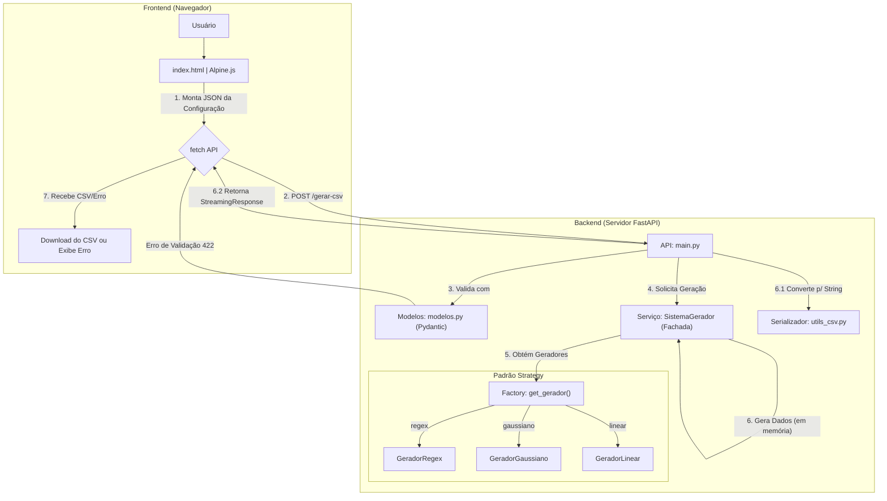

Aqui está uma proposta de README completo para o seu projeto, incorporando as informações dos arquivos, o documento de requisitos e o diagrama de arquitetura em Mermaid.

-----

# Gerador de Dados Sintéticos Flexível

## 1\. 📜 Introdução

O **Gerador de Dados Sintéticos Flexível** é uma ferramenta de software robusta, projetada para criar conjuntos de dados sintéticos em formato CSV com alta configurabilidade. O projeto atende à necessidade de desenvolvedores, testadores, analistas de dados e pesquisadores, fornecendo uma maneira rápida e confiável de gerar dados para testes de software, análise de desempenho ou simulações.

A aplicação é construída como uma moderna aplicação web, utilizando:

  * **Backend:** **FastAPI** para uma API de alta performance.
  * **Frontend:** Uma interface reativa e amigável construída com **Alpine.js** e **Bootstrap**, que se comunica com o backend sem a necessidade de recarregar a página.

O foco principal é permitir que o usuário defina a estrutura de um arquivo CSV e, em seguida, popule cada coluna usando diferentes "estratégias" de geração, como padrões de Expressão Regular (Regex) ou distribuições estatísticas.

## 2\. 🚀 Principais Funcionalidades

O sistema implementa um conjunto abrangente de requisitos funcionais e não funcionais, garantindo flexibilidade e confiabilidade.

  * **Definição Estrutural Completa (RF01):** Permite ao usuário definir o número de linhas, nomes de colunas e a estrutura geral do CSV.
  * **Gerador de Dados por Regex (RF02):** Gera dados textuais que correspondem perfeitamente a qualquer padrão de Expressão Regular (Regex) fornecido.
  * **Gerador de Dados Gaussianos (RF03):** Gera dados numéricos que seguem uma distribuição estatística normal (Gaussiana), com média e desvio padrão configuráveis.
  * **Gerador de Dados Linear (RF06):** Gera dados numéricos que seguem uma tendência linear (ex: uma sequência com incremento fixo).
  * **Validação de Entrada Robusta (RF05):** O sistema valida todas as configurações antes da geração. Isso inclui a verificação da sintaxe de expressões regulares e a garantia de que parâmetros estatísticos (como o desvio padrão) sejam válidos (ex: \> 0).
  * **Configuração de Formato (RF09):** Permite ao usuário configurar o caractere delimitador de campo (ex: `,` ou `;`) e o separador decimal (ex: `.` ou `,`).
  * **Interface de Usuário Reativa (RNF01):** Uma GUI intuitiva que permite ao usuário adicionar, configurar e remover colunas dinamicamente, sem recarregar a página.
  * **Arquitetura Extensível (RF08, RNF07):** O design do sistema (baseado nos padrões *Strategy* e *Factory*) permite que novos tipos de geradores (ex: distribuição uniforme, exponencial) sejam adicionados com esforço mínimo.

## 3\. 🛠️ Tech Stack

| Categoria | Tecnologia | Propósito |
| :--- | :--- | :--- |
| **Backend** | **FastAPI** | Framework da API (ASGI). |
| | **Pydantic** | Validação de dados e modelos de configuração. |
| | **Numpy** | Geração de dados estatísticos (Gaussiano). |
| | **Rstr** | Geração de dados baseados em Regex. |
| | **Uvicorn** | Servidor ASGI para rodar o FastAPI. |
| **Frontend** | **Alpine.js** | Reatividade e gerenciamento de estado da UI. |
| | **Bootstrap** | Layout e componentes de UI. |
| | **Jinja2** | Renderização do template HTML inicial. |
| **Testes** | **Pytest** | Estrutura de testes unitários e de integração. |
| | **HTTPX** | Cliente HTTP para testes de API (`TestClient`). |
| **DevOps** | **Poetry** | Gerenciamento de dependências e pacotes. |
| | **Ruff** | Linter e formatador de código Python. |

## 4\. 🏛️ Diagrama da Arquitetura (Mermaid)

Este diagrama ilustra o fluxo de dados e a arquitetura de componentes da aplicação, desde a interação do usuário até a geração do arquivo final.



## 5\. 📦 Instalação

### Pré-requisitos

  * Python 3.11+
  * [Poetry](https://www.google.com/search?q=https://python-poetry.org/docs/%23installation) (Gerenciador de dependências)

### Passos

1.  Clone o repositório:

    ```bash
    git clone https://github.com/CristhianKapelinski/syntheticdata--generator
    cd syntheticdata-generator
    ```

2.  Instale as dependências usando o Poetry:

    ```bash
    poetry install
    ```

    *(Isso criará um ambiente virtual e instalará todas as dependências listadas no `pyproject.toml` e `poetry.lock`)*

## 6\. ▶️ Executando a Aplicação

Para iniciar o servidor de desenvolvimento (com *hot-reload*), execute o seguinte comando na raiz do projeto:

```bash
poetry run uvicorn src.gerador_dados.main:app --reload --host 0.0.0.0 --port 8000
```

A aplicação estará disponível em: **[http://localhost:8000](https://www.google.com/search?q=http://localhost:8000)**

## 7\. 👨‍💻 Como Usar (Interface Web)

1.  Acesse **[http://localhost:8000](https://www.google.com/search?q=http://localhost:8000)** no seu navegador.
2.  **Configuração Geral:** Defina o número de linhas desejado e, opcionalmente, altere o delimitador (ex: `;`) e o separador decimal (ex: `,`).
3.  **Configuração das Colunas:**
      * O formulário começa com uma coluna.
      * Preencha o **Nome da Coluna**.
      * Selecione o **Tipo de Gerador** (Regex, Gaussiano ou Linear).
      * Campos de parâmetros específicos aparecerão (ex: "Expressão Regular" ou "Média" e "Desvio Padrão").
4.  Clique em **"+ Adicionar Coluna"** para adicionar quantas colunas forem necessárias.
5.  Clique em **"Gerar e Baixar CSV"**.
6.  O sistema irá validar sua entrada.
      * **Se houver erro:** Uma mensagem vermelha aparecerá indicando o problema (ex: "Expressão regular com sintaxe inválida").
      * **Se houver sucesso:** O download do arquivo `dados_sinteticos.csv` iniciará automaticamente.

## 8\. 📁 Estrutura do Projeto

O código-fonte é modular e segue os princípios de separação de responsabilidades.

```
.
├── config/
│   └── exemplo.json       # Exemplo de configuração de entrada
├── src/
│   └── gerador_dados/
│       ├── __init__.py
│       ├── geradores.py   # Padrão Strategy: GeradorRegex, GeradorGaussiano, etc.
│       ├── main.py        # API (Controller): Endpoints FastAPI
│       ├── modelos.py     # Modelos de dados e validação (Pydantic)
│       ├── servicos.py    # Lógica de Orquestração (Facade, Factory)
│       └── utils_csv.py   # Serializador para o formato CSV
├── static/                # (Opcional) CSS/JS estáticos
├── templates/
│   ├── base.html          # Template HTML base
│   └── index.html         # Template do frontend (com Alpine.js)
├── tests/
│   ├── test_api.py        # Testes de integração da API
│   └── test_core.py       # Testes unitários (Geradores, Factory)
├── poetry.lock            # Dependências exatas
├── pyproject.toml         # Definições do projeto e dependências (Poetry)
└── README.md              # Este arquivo
```

## 9\. 🧪 Executando os Testes

Para garantir a qualidade e a confiabilidade do código, execute a suíte de testes com o Pytest:

```bash
poetry run pytest
```

Os testes cobrem:

  * **Testes Unitários (`test_core.py`):** Validam cada gerador (Strategy) isoladamente e a função `get_gerador` (Factory).
  * **Testes de Integração (`test_api.py`):** Testam a API (`/gerar-csv`) de ponta a ponta, incluindo o "caminho feliz", falhas de validação (RF05) e a correta aplicação de delimitadores (RF09).

## 10\. 👥 Autores

  * **Cristhian Eduardo Kapelinski de Avilla** 
  * **Rafael da Silva Moral** 
  * **Lucas Correa Rodrigues** 

## 11\. 📄 Licença

Este projeto é distribuído sob a Licença APACHE.
